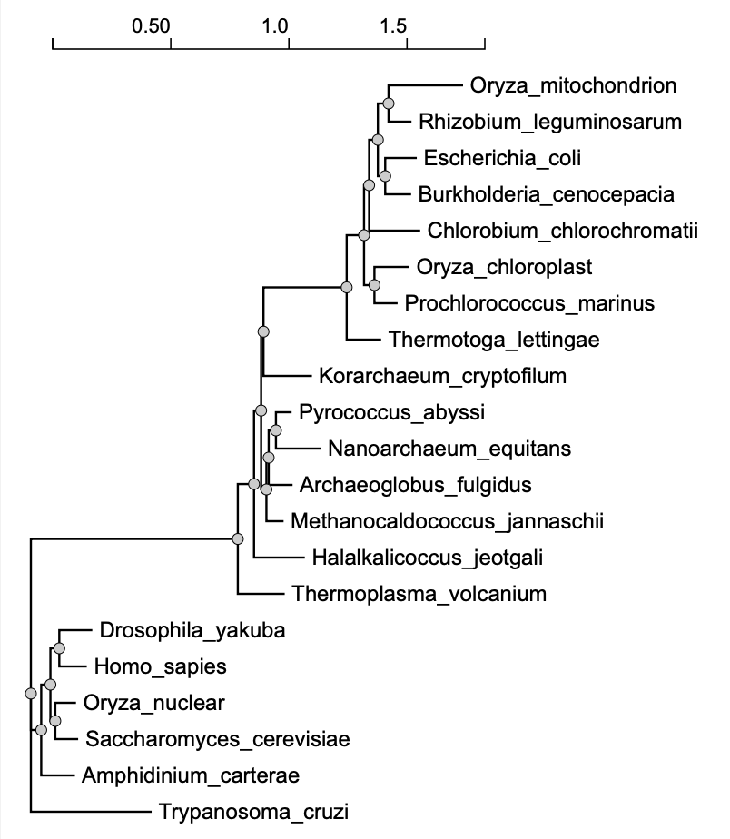

## Exercise 1 - NGPhylogeny.fr

Use NGPhylogeny.fr to analysis the set of rRNA sequence provided. Describe the methods and put the .png file from your analysis into your Lab 8 .Rmd file

The methodology behind NGPhylogeny.fr includes multiple sequence alignment, phylogenetic analysis and the data output is tree visualization.





## Exercise 2 - CIPRES 

Complete. Output files saved in data folder. 

## Exercise 3 - ggTree Tutorial  

Load libraries.

```{r}
library(tidyverse)
library(ggtree)
library(treeio)
library(ggimage)
```

Exercise 1
Download the example tree and read it’s contents.

```{r}
tree <- read.tree("data/tree_newick.nwk")
tree
```

Exercise 1
Create a slanted phylogenetic tree.

```{r}
#?ggtree
ggtree(tree, layout = "slanted")
```
Exercise 1
Create a circular phylogenetic tree.

```{r}
ggtree(tree, layout = "circular")
```
Exercise 1
Create a circular unscaled cladogram with thick red lines.

```{r}
ggtree(tree, layout = "circular", branch.length="none", color="red", size=2)
```
Exercise 2
Create a phylogeny with the following aesthetic characteristics: 
1. tips labeled in purple
2. purple-colored diamond-shape tip points 
(hint: Google search “R point characters”) 
3. large semitransparent yellow node points (hint: alpha=) 
4. Add a title with + ggtitle(…)

```{r}
p <- ggtree(tree)
p + geom_tippoint(color = "purple", pch = 18) + geom_tiplab(color = "purple") + geom_nodepoint(color="yellow", size=6, alpha = 0.5) + ggtitle("Exercise 2 Figure: Not the prettiest phylogenetic aesthetics, but it'll do.")
```
Exercise 3
1. First, find what the MRCA is for taxa B+C, and taxa L+J.
2. Draw the tree with ggtree(tree).
3. Add tip labels.
4. Highlight these clades with separate colors.
5. Add a clade label to the larger superclade (node=17) that we saw before that includes A, B, C, D, and E.
6. Link taxa C to E, and G to J with a dashed gray line.
7. Add a scale bar to the bottom by changing the theme.
8. Add a title.


```{r}
MRCA(tree, c("B", "C"))
```

```{r}
MRCA(tree, c("L", "J"))
```


```{r}
ggtree(tree) + 
  geom_tiplab() + 
  geom_hilight(node=19, fill="purple") + 
  geom_hilight(node=23, fill="gold") +
  geom_cladelabel(node=17, label="Superclade 17", color="red2", offset= -7, align=TRUE) + 
  geom_taxalink("C", "E", color = "grey", linetype = 2) +
  geom_taxalink("G", "J", color = "grey", linetype = 2) +
  theme_tree2() +
  ggtitle("ggTree")
```

9. Optionally, go back to the original ggtree(tree, ...) call and change the layout to "circular".

```{r}
ggtree(tree, layout = "circular") + 
  geom_tiplab() + 
  geom_hilight(node=19, fill="purple") + 
  geom_hilight(node=23, fill="gold") +
  geom_cladelabel(node=17, label="Superclade 17", color="red2", offset= -7, align=TRUE) + 
  geom_taxalink("C", "E", color = "grey", linetype = 2) +
  geom_taxalink("G", "J", color = "grey", linetype = 2) +
  theme_tree2() +
  ggtitle("ggTree")
```

Bonus 

```{r}
set.seed(42)
trees <- lapply(rep(c(10, 25, 50, 100), 3), rtree)
class(trees) <- "multiPhylo"
ggtree(trees) + facet_wrap(~.id, scale="free", ncol=4) + ggtitle("Many trees. Such phylogenetics. Wow.")
```


## Exercise 4 - Using ggtree with the FastTreeMP output file on CIPRES 

Coloring the tree according to the domains of life.

```{r}
my_tree <- read.tree("data/fastree_result.tre")

ggtree(my_tree, branch.length="none", layout = "circular") +
  xlim(0,21) +
  geom_tiplab(hjust=-.1, size = 3) +
  geom_hilight(node=22, fill="green", extend = 0.5) +
  geom_hilight(node=34, fill="gold", extend = 0.5) +
  geom_hilight(node=29, fill="purple", extend = 0.5)

```


