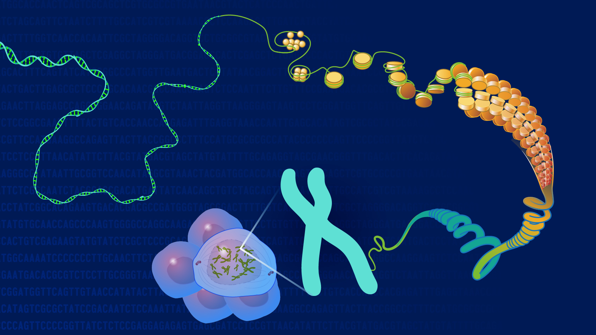

[Lab1](Lab1_katiegilliam.html)

[Lab3a](Lab3/Lab3a.html)

[Lab3b](Lab3/Lab3b.html)

[Lab4a](Lab4.html)

[Lab4b](Lab4b.html)

[Lab5](Lab5.html)

[Lab5x](Lab5x.html)

[Lab6](Lab6.html)

[Lab6x](Lab6x.html)

[Lab9a](Lab9a.html)

[Lab9b](Lab9b.html)

[Lab11](Lab11.html)

[Lab11x](Lab11x.html)

Application written in R [@RCoreTeam] using the Shiny framework [@Chang2015].

# REFERENCES